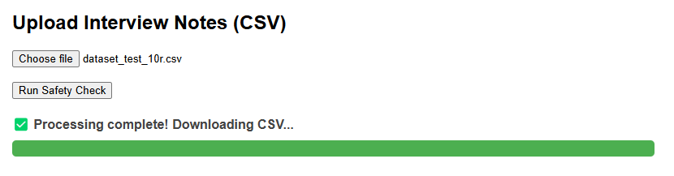

# LLM Wellness Safety Check

A lightweight local web app to assess safety concerns from mental health narrative notes using **Mistral 7B Instruct v0.2** (GGUF) — no internet or API keys needed!

---

## Preview

  
*Upload CSV, run LLM locally, and get structured results with progress tracking.*

---

## Features

* LLM prompt-based assessment of mental health notes
* Upload `.csv` via browser
* Local quantized **Mistral 7B Instruct v0.2**
* Real-time progress bar 
* Outputs a processed `.csv` with structured responses

---

## Project Structure

```
llm-wellness-check/
├── app/                        # Core app logic
│   ├── __init__.py             # Package initializer
│   ├── inference.py            # Calls the LLM with formatted prompts
│   ├── model_loader.py         # Loads the GGUF model via llama-cpp-python
│   ├── prompting.py            # Builds prompt text and inference parameters
│   └── utils.py                # CSV processing, progress writing, helper functions
│
├── assets/
│   └── ui-preview.png          
│
├── models/                     # Place downloaded .gguf model here (not tracked by Git)
│   └── mistral-7b-instruct-v0.2.Q4_K_M.gguf  # Local LLM model file (not tracked by Git)
│
├── static/
│   └── .keep                   # Placeholder to keep the static folder in Git
│
├── templates/
│   └── index.html              # Upload UI served by Flask
│
├── uploaded/                   # Temp directory for uploaded CSVs
├── output/                     # Directory where processed CSVs are saved
│
├── app.py                      # Main Flask app entry point
├── progress.json               # Tracks how many rows are processed (for frontend progress bar)
├── requirements.txt            # Python dependencies list
├── .gitignore                  # Files/folders to exclude from Git
└── README.md                   # Project documentation
```

---

##  Setup Instructions

### 1. Clone the repository

```bash
git clone https://github.com/your-username/llm-safety-check.git
cd llm-safety-check
```

### 2. Set up a virtual environment (optional but recommended)

```bash
python -m venv .venv
source .venv/bin/activate    # macOS/Linux
# OR
.venv\Scripts\activate       # Windows
```

### 3. Install dependencies

```bash
pip install -r requirements.txt
```

---

## Download the Mistral 7B Instruct Model

1. Visit the Hugging Face model page:  
   👉 [TheBloke/Mistral-7B-Instruct-v0.2-GGUF](https://huggingface.co/TheBloke/Mistral-7B-Instruct-v0.2-GGUF)

2. Download the following model file (recommended):  
   **`mistral-7b-instruct-v0.2.Q4_K_M.gguf`**

3. Inside your project directory, create a folder named `models` if it doesn’t already exist:

   ```bash
   mkdir models
    ```
4. Move or copy the downloaded model file into the models/ folder:

    ```
      llm-wellness-check/models/mistral-7b-instruct-v0.2.Q4_K_M.gguf
    ```
5. Ensure the model file is named exactly as shown above. The app will look for this specific filename when loading the model.

---

##  Run the Application

1. Start the Flask app
```bash
python app.py
```
2. Open your browser and go to
http://localhost:5000

3. You'll see a web form to upload a CSV file and start the safety analysis.

## CSV Format
Your CSV should contain the following columns:

* `QUESTION_ID`

* `Anonymized Narrative`

The app will automatically:

* Map the `QUESTION_ID` to a readable `question_text`
* Generate a new `LLM_Response` column using the Mistral model

---
## Testing Tips

* Start with a small file (e.g., 5–10 rows)
* Try 50–100 rows to evaluate speed
* 1000+ rows may take time depending on your system's RAM and CPU